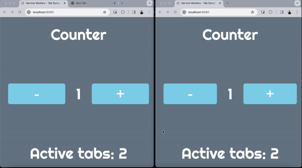

# Sync state and find active tabs using service workers

## Objectives

- Share state between tabs
- Find the number of active tabs on a page

This could be useful to sync states between tabs like themes, authentication or to restrict users from using the service in more than 1 place

